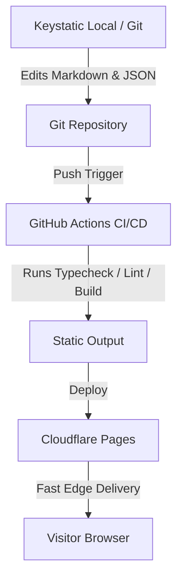

# Architecture

<callout icon="♞">**Status:** Active · **Owner:** Gen · **Last Reviewed:** 2026-07-18</callout>

This document details the system architecture, rendering patterns, data flows, and structural invariants.

## Rendering Model

- **Static-Site Generation (SSG) by Default**: All public-facing routes are built statically at compile time and served from Cloudflare's global edge network.
- **Selective Island Hydration**: Interactivity is limited to small "islands" built using React (e.g., search, form feedback) and hydrated only when visible.
- **Static Assets**: Images are optimized at build time using Astro `<Image>` and `<Picture>` components.

## Data Flow

## Core Invariants

1. **Content Portability**: Content is kept in plain Markdown/MDX, JSON, or YAML.
2. **Zero Run-time DB**: There is no live database connection required for the website core.
3. **No Unauthenticated Server Exec**: All client actions are static pages; dynamic integrations (like forms) use serverless API endpoints.
