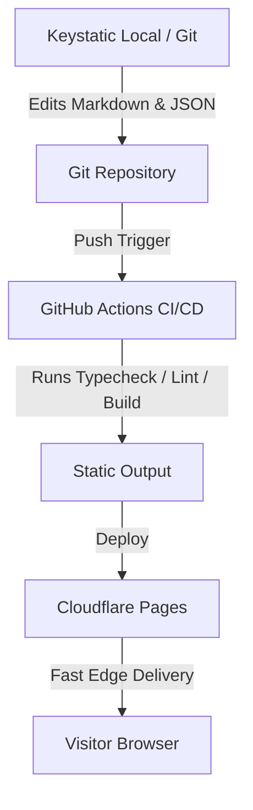

# Architecture

<callout icon="♞">**Status:** Active · **Owner:** Gen · **Last Reviewed:** 2026-07-18</callout>

This document details the system architecture, rendering patterns, data flows, and structural invariants.

## Rendering Model

- **Static-Site Generation (SSG) by Default**: All public-facing routes are built statically at compile time and served from Cloudflare's global edge network.
- **Selective Island Hydration**: Interactivity is limited to small "islands" built using React (e.g., search, form feedback) and hydrated only when visible.
- **Static Assets**: Images are optimized at build time using Astro `<Image>` and `<Picture>` components.

## Data Flow

## Core Invariants

1. **Content Portability**: Content is kept in plain Markdown/MDX, JSON, or YAML.
2. **Zero Run-time DB**: There is no live database connection required for the website core. The live chat feature uses Cloudflare KV for cross-isolate message persistence with HTTP polling (not WebSockets).
3. **No Unauthenticated Server Exec**: All client actions are static pages; dynamic integrations (like forms and chat) use serverless API endpoints.

## Paused Sections

Three collection routes are temporarily suspended while their real content is being written:

- **`/research`** — paused; placeholder renders the `<UnderConstruction />` component
- **`/posts`** — paused; placeholder renders the `<UnderConstruction />` component
- **`/experiments`** — paused; placeholder renders the `<UnderConstruction />` component

The shared component lives at `src/components/UnderConstruction.astro` and takes the section's eyebrow label, a heading, an italic Fraunces lead, an optional explanatory paragraph, an ETA line, and primary/secondary CTAs. Each stub picks a signature chess piece (knight for Research, bishop for Writing, rook for Lab) rendered through `<ChessIcons variant="woodcut">` so it responds to dark mode automatically.

The prior content is preserved untouched at `src/content/_archive/<section>-index.astro`. To restore any of these sections, move the archived file back to `src/pages/<section>/index.astro` and delete the stub.

Detail routes (e.g. `/research/[slug]`, `/posts/[slug]`, `/experiments/[slug]`) remain live so direct deep links still resolve; only the indexes are paused.
