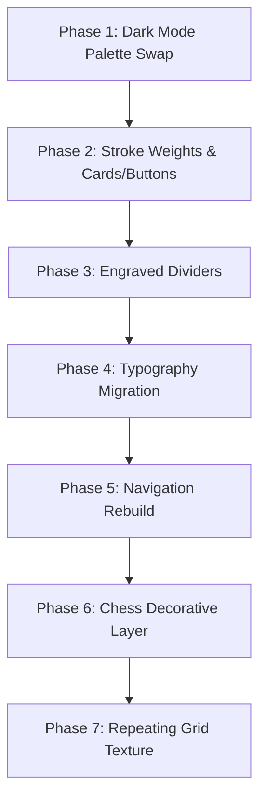

# Woodcut Theme Redesign Roadmap

<callout icon="♞">**Status:** Implemented · **Owner:** Gen · **Created:** 2026-07-21</callout>

This document details the engineering steps, target files, and verification checkpoints for implementing the [Woodcut & Engraving Visual Theme](./WoodcutTheme.md).

---

## Phased Execution Plan



### Phase 1: True-Black Dark Mode Palette Swap

Swap the existing charcoal theme tokens with the new high-contrast true-black palette.

- **Task 1.1**: Replace the `.dark` class block in [tokens.css](../../src/styles/tokens.css) with the new raw hex colors (Ground: `#000000`, Card Surface: `#0d0d0f`, Recessed: `#12121a`, Text: `#f0f4ff`, Primary: `#8fb0dc`).
- **Verification**:
  - Verify color mapping via browser visual check.
  - Run linting, Astro compiler, and build verification:
    ```bash
    npx pnpm run lint
    npx pnpm run check
    npx pnpm run build
    ```
  - Run Playwright tests to ensure theme toggler logic and localStorage theme synchronization still passes:
    ```bash
    npx pnpm run test:e2e
    ```

---

### Phase 2: Stroke Weights & Core Components

Migrate borders from 1px outline weights to high-contrast engraving offsets and standard structural stroke weights.

- **Task 2.1**: Define new stroke weights in [tokens.css](../../src/styles/tokens.css):
  - `--stroke-structural: 2.5px`
  - `--stroke-detail: 1.5px`
  - `--stroke-hatch: 1.3px`
  - `--stroke-fine: 1.0px`
- **Task 2.2**: Update [Button.astro](../../src/components/primitives/Button.astro) and [LinkButton.astro](../../src/components/primitives/LinkButton.astro):
  - Increase border weight to `2.5px solid currentColor`.
  - Add hard-offset hover shadow (`box-shadow: 2px 2px 0 currentColor`).
  - Add pressed offset (`translate(2px, 2px)` with no shadow).
- **Task 2.3**: Update [Card.astro](../../src/components/primitives/Card.astro):
  - Increase border to `2px solid var(--color-border-custom)`.
  - Apply custom coordinates or L-shaped ornaments using pseudo-elements `::before`/`::after` (§3.2 of spec).
  - Swap soft shadows (`shadow-md`) with hard offsets (`3px 3px 0 var(--color-border-custom)`).
  - Tighten corners from `rounded-lg` to `rounded-sm` (4px).

---

### Phase 3: Engraved Section Dividers

Replace standard horizontal rule styles with structural engraved motifs.

- **Task 3.1**: Create `DividerChessboard.astro` inside `src/components/primitives/` (reusable strip of alternating squares).
- **Task 3.2**: Create `DividerKnight.astro` inside `src/components/primitives/` (vector chess-piece marker centred on a line).
- **Task 3.3**: Refactor layout files and content page templates (such as `about.astro`, `experience.astro`, `projects/index.astro`, `experiments/index.astro`) to replace standard `<hr>` and `border-t` with the new divider primitives.

---

### Phase 4: Classical Typography Migration

_Warning: Requires explicit package approvals prior to step execution._

- **Task 4.1**: Install Google Font variables (Fraunces and Gochi Hand) using pnpm:
  ```bash
  npx pnpm install @fontsource-variable/fraunces @fontsource/gochi-hand
  ```
- **Task 4.2**: Register imports at the top of [global.css](../../src/styles/global.css).
- **Task 4.3**: Add font family definitions to [tokens.css](../../src/styles/tokens.css) and map them in `@theme` in [global.css](../../src/styles/global.css):
  - `--font-display: "Fraunces Variable", "Fraunces", Georgia, serif`
  - `--font-hand: "Gochi Hand", cursive`
- **Task 4.4**: Apply `Fraunces` to display elements (`text-display`, `text-h1`, `text-h2`) and enable `WONK` setting. Apply `Gochi Hand` selectively to tagline subheadings and 404 pages according to the strict usage boundaries (§4.1 of spec).

---

### Phase 5: Fixed Navigation Sidebar Redesign

Move navigation from the sticky horizontal top bar to a fixed left sidebar.

- **Task 5.1**: Redesign Desktop Layout in [BaseLayout.astro](../../src/layouts/BaseLayout.astro):
  - Reposition `<header>` to `fixed inset-y-0 left-0 w-56 border-r-2.5 bg-surface`.
  - Offset main content container by `lg:pl-56`.
- **Task 5.2**: Create `ChessIcons.astro` component to hold the custom SVG icons for page routes. Wire them into nav list links.
- **Task 5.3**: Add absolute positioned active link marker `♞` inside nav layout.
- **Task 5.4**: Rebuild Mobile Layout in [BaseLayout.astro](../../src/layouts/BaseLayout.astro):
  - Create sticky top bar (`52px`) containing the logo and hamburger menu button.
  - Create a full-viewport modal overlay for menu items containing responsive tap-targets (minimum 44px).
- **Task 5.5**: **E2E Test Updates**: Rewrite [navigation.spec.ts](../../tests/e2e/navigation.spec.ts) navigation locators and desktop/mobile viewport asserts to align with the new sidebar elements.

---

### Phase 6: Chess Motif & Decorative Details

Incorporate thematic details to refine the layout feel.

- **Task 6.1**: Update blockquotes in [global.css](../../src/styles/global.css) and prose classes:
  - Replace single-side border with double rules.
  - Embed `♛` watermark using a CSS pseudo-element.
- **Task 6.2**: Re-style paginations on blog and project index routes to use `♜` and `♖` indicators.
- **Task 6.3**: Redesign the 404 error template route to feature a knocked-over chess knight.

---

### Phase 7: Pattern Textures & Refinement

- **Task 7.1**: Add the `.chess-grid` repeating CSS background pattern utility class.
- **Task 7.2**: Selectively overlay the chess grid pattern onto the body and empty card media containers.

---

## Verification Criteria

Each phase must pass the verification gates:

1.  **Format Compliance**: `npx pnpm run format:check`
2.  **Lint Check**: `npx pnpm run lint`
3.  **Astro compilation Diagnostics**: `npx pnpm run check` (0 errors, 0 warnings)
4.  **Production Compilation**: `npx pnpm run build`
5.  **E2E Specs**: `npx pnpm run test:e2e` (all 30 tests pass)
6.  **Accessibility audits**: `npx pnpm run test:a11y` (0 axe-core violations)
