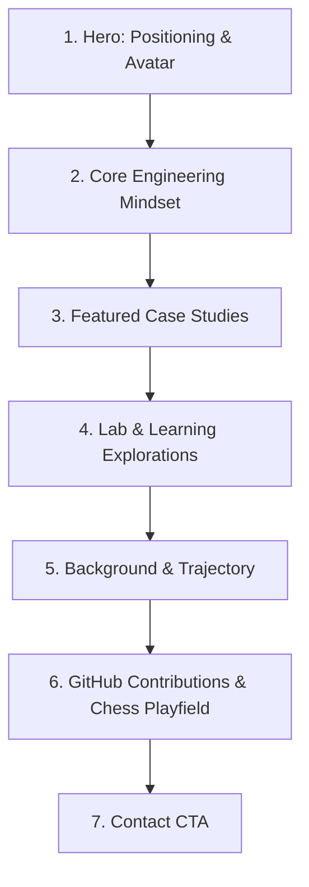

# Home Page Information Architecture & Content Strategy Specification

<callout icon="♞">**Status:** Approved · **Owner:** Sam & Gen · **Date:** 2026-07-24 · **Version:** 1.0.0</callout>

This document is the official **Source of Truth** and Content Specification for the **Home Page (`/`)**. All future updates, component additions, and content edits to the Home page must strictly follow the rules, hierarchy, data bindings, and constraints defined here.

---

## 1. Page Purpose & Positioning

### Primary Purpose

The Home page serves as a **Curated Portal & Executive Summary** for the personal portfolio. It presents an authentic, evidence-driven overview of technical capability, engineering mindset, and background, guiding visitors to dedicated sub-pages (`/projects`, `/about`, `/experience`, `/posts`, `/contact`) for deep-dive details.

### First 5–10 Seconds Takeaway

Within 10 seconds of landing, a visitor must understand:

1. **Who**: A Bachelor of Industrial Technology major in Computer and early-career software builder.
2. **What**: Focuses on structured problem decomposition, maintainable web architecture, and disciplined development.
3. **How**: Pairs human architectural ownership and rigorous verification with AI-accelerated workflows.

### Intended Impression

- **Authentic & Honest**: Zero posture, fake titles, or exaggerated years of experience.
- **Disciplined & Rigorous**: Values design specifications, clean code, strict typing, accessibility, and automated testing.
- **Engraved Identity**: Visually aligned with the woodcut/engraving design system—high contrast, fine linework, restrained typography.

---

## 2. Target Audience Intent & Expectations

| Audience                    | What They Are Looking For                                                      | How the Home Page Delivers                                                                  |
| --------------------------- | ------------------------------------------------------------------------------ | ------------------------------------------------------------------------------------------- |
| **Recruiters & HR**         | Role fit, technical major, scannable clarity, contact info.                    | Authentic hero stance, scannable principle cards, clear navigation to resume/contact.       |
| **Hiring Managers**         | Problem-solving approach, code quality, trade-off awareness, growth potential. | Core Engineering Mindset section, featured case study teasers with trade-off notes.         |
| **Engineers & Peers**       | Architecture quality, tooling, test rigor, AI workflow maturity.               | Links to engineering specs (`docs/plans/`), verification metrics, GitHub repository access. |
| **Clients & Collaborators** | Reliability, clear communication, project execution capability.                | Problem decomposition stance, clear CTA, direct contact pathways.                           |
| **Students & Learners**     | Inspiration, shared journey, modern web stack implementation.                  | Transparent learning trajectory, lab experiment previews, open specs.                       |

---

## 3. Information Architecture & Content Hierarchy

The Home page consists of **7 top-to-bottom sections**. Each section has a distinct role and strict content boundaries:

- **Why It Exists**: Hooks visitors instantly with an honest statement of identity, visual identity, and technical capability.
- **Content & Element Requirements**:
  - **Interactive Profile Avatar (Woodcut SVG → Photo Reveal)**:
    - _Default State_: A stylized theme-aware woodcut SVG engraving avatar (aligning with `SVGRules.md` and `WoodcutTheme.md`).
    - _Hover / Focus State_: On hover, keyboard focus (`:focus-visible`), or touch-tap, smoothly transitions (200ms opacity/transform cross-fade) to reveal a clean PNG portrait photo of the owner.
    - _Frame & Styling_: 2.5px structural stroke border (`--stroke-structural`), hard-offset shadow (`3px 3px 0 var(--color-ink)`), and 12px border-radius (`rounded-lg`).
    - _Accessibility_: Explicit `alt` text, keyboard navigable (`tabindex="0"`), and respects `prefers-reduced-motion` for instant swap fallback.
  - **Eyebrow**: `Bachelor of Industrial Technology (Computer) · Early-Career Software Builder`
  - **Headline**: Clear stance on building maintainable, human-centered software.
  - **Subheadline**: _"Combining structured problem decomposition with AI-paired workflows to craft fast, accessible web applications."_
  - **Action Buttons**: `Explore Case Studies` (`/projects`) and `Read Engineering Specs` (`/docs/plans/`).
- **Data Source**: Static configuration in `src/content/data/site.json` (pointing to SVG asset `src/assets/brand/avatar.svg` and photo asset `src/assets/brand/portrait.png`).

### Section 2: Strategy Before Code (Opening Principles)

- **Why It Exists**: Demonstrates _how_ problems are approached and solved before visitors inspect individual projects, connecting software engineering discipline to chess opening principles.
- **Content Requirements (5 Layered Principle Cards)**:
  1. **Strategy Before Code** (`01 · Calculation`): Great software is built by thinking several moves ahead before touching the keyboard.
  2. **Context Over Memory** (`02 · Record Keeping`): Clear documentation turns individual knowledge into lasting team clarity and preserves context for human teammates & AI partners.
  3. **AI as a Partner, Not a Crutch** (`03 · Force Multiplier`): AI accelerates research and iteration, but human judgement owns architectural decisions and trade-offs.
  4. **Evidence Over Assumptions** (`04 · Position Validation`): A feature is only complete when it has been tested and verified to work reliably.
  5. **Continuous Refinement** (`05 · Post-Game Analysis`): Every project is an opportunity to learn, adapt, and refine the craft.
- **Data Source**: Structural Astro component (`src/components/sections/CoreMindset.astro`).

### Section 3: Featured Case Studies (Proof of Work)

- **Why It Exists**: Provides tangible evidence of technical execution and trade-off analysis.
- **Content Requirements**:
  - **Limit**: Maximum **3 curated project cards** (e.g. _Personal Portfolio Architecture_, _Distributed System Simulation_, _Industrial Technology Capstone_).
  - **Card Content**: Title, short summary (≤2 sentences), tech stack badges, key trade-off note, and direct link to full case study on `/projects/[slug]`.
  - **Footer Link**: _"View All Projects →"_ pointing to `/projects`.
- **Data Source**: Dynamic query from Astro v5 `projects` Content Collection filtering `featured: true`.

### Section 4: Lab & Learning Explorations (Active Growth Log)

- **Why It Exists**: Highlights active curiosity and continuous skill acquisition without posturing.
- **Content Requirements**:
  - **Limit**: Maximum **2 latest lab notes or technical prototypes**.
  - **Card Content**: Title, topic tag (e.g. _Astro v5 Loaders_, _axe-core A11y Audit_), date, reading time, short excerpt.
  - **Footer Link**: _"Explore All Articles & Lab Notes →"_ pointing to `/posts`.
- **Data Source**: Dynamic query from Astro v5 `posts` or `experiments` Content Collection.

### Section 5: Background & Trajectory (Biographical Context)

- **Why It Exists**: Gives honest context on education, current status, and career goals.
- **Content Requirements**:
  - **Education**: Bachelor of Industrial Technology major in Computer.
  - **Focus Areas**: Web Standards, Software Design, Developer Tooling, Systems Engineering.
  - **Narrative**: Concise 2-paragraph overview emphasizing continuous learning and growth.
  - **Link**: _"Read Full About Story →"_ pointing to `/about`.
- **Data Source**: `src/content/data/about.json` singleton or `work-experience.json`.

### Section 6: Interactive GitHub Contributions & Chess Playfield (Bottom Activity Strip)

- **Why It Exists**: Provides visual, verifiable proof of active daily coding habit and public repository activity on GitHub (`https://github.com/SamAnaniasCases`), while playfully reinforcing the site's chess design theme.
- **Content & Element Requirements**:
  - **GitHub Activity Grid**: Displays the contribution activity grid (52 weeks of contribution squares), visually styled to match the woodcut theme.
  - **Interactive ♔ King Piece**: Renders a theme-bound ♔ King piece on the contribution grid. Visitors can freely move the King across the contribution squares via drag-and-drop, clicking target cells, or using keyboard controls.
  - **Contribution Tooltip / Cell Details**: Moving the King over a cell highlights the date and contribution count for that day.
  - **Frame & Styling**: Outer frame uses 2.5px structural stroke border (`--stroke-structural`), hard offset shadow (`3px 3px 0 var(--color-ink)`), and theme-adaptive activity shading (warm ink in light mode, true-black accent in dark mode).
  - **Component Architecture**: Built as a client-hydrated React island (`src/components/islands/GitHubChessGrid.tsx` with `client:visible`) adhering to Handbook §2 and Rule 2 of Engagement.
  - **Accessibility & Motion**: Full keyboard control (Arrow keys move the King piece; Enter inspects cell data), explicit `aria-label` describing the contribution calendar, and instant position update under `prefers-reduced-motion`.

### Section 7: Contact CTA (Conversion Finish)

- **Why It Exists**: Low-friction conversion path for recruiters, collaborators, and visitors.
- **Content Requirements**:
  - **Headline**: "Let's Build Together" or "Get in Touch".
  - **Body**: Invitation for software opportunities, technical discussions, or code feedback.
  - **Actions**: Direct email link, GitHub profile link, LinkedIn link, or contact page link (`/contact`).
- **Data Source**: `src/content/data/site.json` singleton.

---

## 4. Content Rules & Copy Guidelines

### Writing Style & Tone

- **Evidence Over Adjectives**: Replace claims like "expert developer" with concrete facts like "builds static SSG applications verified with axe-core automated audits".
- **Active & Direct**: Use strong, direct verbs (_design_, _build_, _verify_, _decompose_).
- **Concise**: Strict sentence limits per component (Hero subheadline ≤2 sentences; Card descriptions ≤2 sentences).

### AI-Partner Positioning Guidelines

- **Always Frame AI as a Tool / Partner**: Describe AI as an interactive development accelerator (like an IDE autocompleter, linter, or pair programmer).
- **Emphasize Human Ownership**: Clearly state that human developers define the specs, design the architecture, select the schemas, make trade-offs, and run verification suites.

### Prohibited Content (Never Include on Home Page)

- ❌ Fake or inflated job titles ("Senior Architect", "Tech Lead", "Guru").
- ❌ Unsubstantiated metrics (e.g. "10x productivity" or "100% bug free").
- ❌ Vague marketing buzzwords ("cutting-edge", "revolutionary", "synergy").
- ❌ Giant blocks of text (keep prose under 68ch measure; push deep narrative to `/about`).
- ❌ Auto-playing media, unconstrained animations, or novelty custom cursors.

---

## 5. Content Management & Data Source Strategy

| Section               | Data Source                                        | Format                                             | Why This Source?                                                                      |
| --------------------- | -------------------------------------------------- | -------------------------------------------------- | ------------------------------------------------------------------------------------- |
| **Hero**              | `src/content/data/site.json` & `src/assets/brand/` | JSON Singleton (`file` loader) & processed SVG/PNG | Single source of truth for site identity, positioning, and dual-state profile avatar. |
| **Principles**        | `src/content/data/site.json`                       | JSON Singleton                                     | Centralized mindset cards easily editable via CMS.                                    |
| **Featured Projects** | `src/content/projects/*.md`                        | Markdown + Frontmatter (`glob` loader)             | Dynamic build-time query (`featured: true`) keeps home fresh.                         |
| **Lab Notes**         | `src/content/posts/*.md`                           | Markdown + Frontmatter (`glob` loader)             | Automatic latest-entries query sorts by publication date.                             |
| **Background**        | `src/content/data/about.json`                      | JSON Singleton                                     | Structured biographical record reused across `/` and `/about`.                        |
| **Contact CTA**       | `src/content/data/site.json`                       | JSON Singleton                                     | Shared contact endpoints across header, footer, and landing pages.                    |

---

## 6. Future Scalability & Clutter Prevention

To prevent the Home page from becoming bloated over years of development:

1. **Strict Slot Caps**:
   - Featured Projects: **Hard cap of 3**.
   - Lab Notes: **Hard cap of 2**.
   - Principles: **Hard cap of 4 cards**.
2. **Push Depth to Sub-pages**:
   - If a section exceeds its slot cap, old items automatically rotate off the Home page into their respective archive pages (`/projects`, `/posts`, `/experience`).
3. **No Direct Copy Duplication**:
   - Home page components consume schema view-models from content collections; never copy-paste project details into `.astro` component files.

---

## 7. SEO, Accessibility & Performance Requirements

### SEO Baseline

- **Title Tag**: `Sam | Industrial Technology & Software Builder`
- **Meta Description**: Concise 150-character summary highlighting software architecture, web performance, and AI-paired development.
- **Structured Data (JSON-LD)**: Inject `Person` and `WebSite` schemas into the document `<head>` via `BaseLayout.astro`.
- **Heading Hierarchy**: Exactly one `<h1>` (in Hero); logical `<h2>` for sections; `<h3>` for cards.

### Accessibility Baseline (WCAG 2.2 AA)

- Text contrast ratio ≥ 4.5:1 (light and dark mode).
- Touch targets ≥ 44×44 CSS px.
- Visible focus rings (`2px` outline with `2px` offset).
- Respect `prefers-reduced-motion` for all transitions.

### Performance Budget

- **LCP** ≤ 2.5s on mobile 4G.
- **CLS** ≤ 0.1.
- **INP** ≤ 200ms.
- **Client JS**: 0 bytes default (100% static SSG HTML/CSS).

---

## 8. Invariants for AI Agents & Developers

When creating or modifying the Home page in the future, all developers and AI agents **MUST**:

1. **Consult This Spec**: Read this document (`docs/plans/0001-home-page-specification.md`) before editing `src/pages/index.astro` or home section components.
2. **Preserve Semantic Tokens**: Use CSS variables from `src/styles/tokens.css` via Tailwind classes (e.g. `bg-surface`, `text-primary`). **Never hardcode hex colors**.
3. **Keep Presentation & Data Separate**: Edit content inside `src/content/` files, not inside Astro component markup.
4. **Follow Verification Sequence**: Before declaring work completed, execute:
   - `cmd /c "npx pnpm run format"`
   - `cmd /c "npx pnpm run lint"`
   - `cmd /c "npx pnpm run check"` (verifying 100% relative link portability)

---

## Related Documentation

- [Handbook](../../Portfolio%20Architecture%20%26%20Engineering%20Handbook%202e6dfc6171c0423a8fc61d2f398ece49.md) — Canonical source of truth.
- [Coding Standards](../engineering/CodingStandards.md) — TypeScript & component rules.
- [Design System](../design/DesignSystem.md) — Tokens, typography, and stroke weights.
- [Folder Structure](../architecture/FolderStructure.md) — Directory map & import boundaries.
