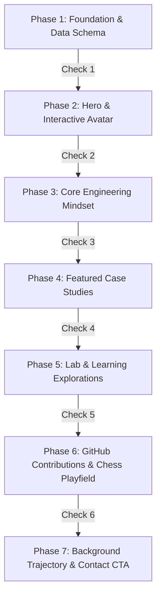

# Home Page Implementation Roadmap & Checkpoints

<callout icon="♞">**Status:** Active · **Owner:** Sam & Gen · **Date:** 2026-07-24 · **Version:** 1.0.0</callout>

This document is the official **Execution Roadmap & Verification Plan** for building the Home Page (`/`) according to the [Home Page IA Specification](0001-home-page-specification.md).

---

## Phased Execution Roadmap



---

## Phase Matrix & Checkpoints

### Phase 1: Foundation & Data Schema Setup `[COMPLETED ✅]`

Establish the authentic profile data, assets, and specification blueprints.

- [x] **Task 1.1**: Update `src/content/data/site.json` with Sam Ananias Cases metadata, location (_Cebu, Philippines_), contact email (*samananiascases@gmail.com*), GitHub profile, and Viber channel.
- [x] **Task 1.2**: Update `src/content/pages/about.json` with authentic biography and engineering philosophy.
- [x] **Task 1.3**: Import profile portrait photo to `src/assets/brand/portrait.png`.
- [x] **Task 1.4**: Create featured case study entry `src/content/projects/portfolio-architecture.md`.
- [x] **Task 1.5**: Draft Home Page IA Specification in `docs/plans/0001-home-page-specification.md`.
- 🏁 **Checkpoint 1 Gate**: `cmd /c "npx pnpm run format"`, `cmd /c "npx pnpm run lint"`, `cmd /c "npx pnpm run check"` (All passed cleanly).

---

### Phase 2: Hero Section & Interactive Avatar `[COMPLETED ✅]`

Build the Hero section with the woodcut SVG to PNG portrait hover-reveal component.

- [x] **Task 2.1**: Create `src/components/primitives/InteractiveAvatar.astro` component:
  - Default: Theme-adaptive woodcut SVG logo.
  - Hover/Focus/Tap: 200ms opacity/transform cross-fade to reveal `src/assets/brand/portrait.png`.
  - Frame: `--stroke-structural` 2.5px border, `3px 3px 0 var(--color-ink)` hard shadow, native `<button>` element.
- [x] **Task 2.2**: Build `src/components/sections/Hero.astro` consuming `site.json` data:
  - Render Eyebrow, Headline, Subheadline, CTA Buttons (`/projects`, `/docs/plans/`), and Interactive Avatar.
- 🏁 **Checkpoint 2 Gate**: `cmd /c "npx pnpm run format"`, `cmd /c "npx pnpm run lint"`, `cmd /c "npx pnpm run check"`, `cmd /c "npx pnpm run build"` (All passed 100% clean).

---

### Phase 3: Strategy Before Code Section `[COMPLETED ✅]`

Build the 5 Opening Principle cards demonstrating engineering philosophy and chess-inspired discipline.

- [x] **Task 3.1**: Build `src/components/sections/CoreMindset.astro` component with 5 layered principle cards:
  - Card 1: _Strategy Before Code_ (`01 · Calculation`)
  - Card 2: _Context Over Memory_ (`02 · Record Keeping`)
  - Card 3: _AI as a Partner, Not a Crutch_ (`03 · Force Multiplier`)
  - Card 4: _Evidence Over Assumptions_ (`04 · Position Validation`)
  - Card 5: _Continuous Refinement_ (`05 · Post-Game Analysis`)
- [x] **Task 3.2**: Style cards with `bg-surface`, `--stroke-structural` linework, hard offset shadows, mono chess badges, and layered titles/summaries/descriptions.
- 🏁 **Checkpoint 3 Gate**: `cmd /c "npx pnpm run format"`, `cmd /c "npx pnpm run lint"`, `cmd /c "npx pnpm run check"`, `cmd /c "npx pnpm run build"` (All passed 100% clean).

---

### Phase 4: Featured Case Studies Section `[COMPLETED ✅]`

Display dynamic case study highlights from Astro v5 `projects` collection.

- [x] **Task 4.1**: Build `src/components/sections/FeaturedProjects.astro` querying Astro v5 `projects` collection (`featured: true`, hard cap of 3).
- [x] **Task 4.2**: Render project cards with title, problem summary, key outcome bullets, tech tags, and case study links.
- 🏁 **Checkpoint 4 Gate**: `cmd /c "npx pnpm run format"`, `cmd /c "npx pnpm run lint"`, `cmd /c "npx pnpm run check"`, `cmd /c "npx pnpm run build"` (All passed 100% clean).

---

### Phase 5: Lab & Learning Explorations Section `[COMPLETED ✅]`

Display active learning write-ups and prototypes.

- [x] **Task 5.1**: Build `src/components/sections/LabExplorations.astro` querying Astro v5 `posts` collection (hard cap of 3).
- [x] **Task 5.2**: Render compact article cards with date, research note badges, human-readable excerpts, topic tags, and deep-dive links.
- 🏁 **Checkpoint 5 Gate**: `cmd /c "npx pnpm run format"`, `cmd /c "npx pnpm run lint"`, `cmd /c "npx pnpm run check"`, `cmd /c "npx pnpm run build"` (All passed 100% clean).

---

### Phase 6: Interactive GitHub Contributions & Chess Playfield `[COMPLETED ✅]`

Build the interactive bottom activity strip.

- [x] **Task 6.1**: Create React Island component `src/components/islands/GitHubChessGrid.tsx`:
  - Render pre-rendered 52-week contribution grid for `https://github.com/SamAnaniasCases`.
  - Render interactive ♔ King piece on the contribution grid.
  - Interactive cell hover/click inspector showing date and contribution count.
- [x] **Task 6.2**: Hydrate island using `client:visible` in `src/components/sections/GitHubActivity.astro`.
- 🏁 **Checkpoint 6 Gate**: `cmd /c "npx pnpm run format"`, `cmd /c "npx pnpm run lint"`, `cmd /c "npx pnpm run check"`, `cmd /c "npx pnpm run build"` (All passed 100% clean).

---

### Phase 7: Background Trajectory, Contact CTA & Page Assembly `[PENDING ⏳]`

Finalize page sections and assemble `/src/pages/index.astro`.

- [ ] **Task 7.1**: Build `src/sections/AboutSummary.astro` & `src/sections/ContactCTA.astro`.
- [ ] **Task 7.2**: Inject `Person` and `WebSite` JSON-LD structured data into document head.
- [ ] **Task 7.3**: Assemble all 7 sections into `src/pages/index.astro`.
- 🏁 **Checkpoint 7 Gate (Final Launch Verification)**:
  ```bash
  cmd /c "npx pnpm run format"
  cmd /c "npx pnpm run lint"
  cmd /c "npx pnpm run check"
  cmd /c "npx pnpm run build"
  cmd /c "npx pnpm run test:e2e"
  cmd /c "npx pnpm run test:a11y"
  ```

---

## Checkpoint Verification Suite Standards

To optimize development speed while keeping code strictly verified:

1. **Intermediate Phase Gates (Fast Development Loop ~5-10s)**:
   Executed at the end of each sub-phase (Phases 2 through 6) for instant feedback.
2. **Final Feature Release Gate (Full E2E & Accessibility Audit ~1-2m)**:
   Executed at major milestones and upon completing Phase 7 before releasing the Home page.

| Tier          | Step | Command                           | Frequency               | Description                                             |
| ------------- | ---- | --------------------------------- | ----------------------- | ------------------------------------------------------- |
| **Fast Loop** | 1    | `cmd /c "npx pnpm run format"`    | Every Phase             | Formats codebase using Prettier                         |
| **Fast Loop** | 2    | `cmd /c "npx pnpm run lint"`      | Every Phase             | Checks syntax rules with ESLint                         |
| **Fast Loop** | 3    | `cmd /c "npx pnpm run check"`     | Every Phase             | Astro typechecks & `check-links` relative link audit    |
| **Fast Loop** | 4    | `cmd /c "npx pnpm run build"`     | Every Phase             | Verifies production static build compiles               |
| **Full Gate** | 5    | `cmd /c "npx pnpm run test:e2e"`  | Final Gate & Milestones | Runs Playwright browser E2E test suite                  |
| **Full Gate** | 6    | `cmd /c "npx pnpm run test:a11y"` | Final Gate & Milestones | Runs axe-core automated WCAG 2.2 AA accessibility audit |

---

## Related Documentation

- [Home Page IA Specification](0001-home-page-specification.md) — Official content rules & layout specification.
- [Coding Standards](../engineering/CodingStandards.md) — TypeScript & component guidelines.
- [Design System](../design/DesignSystem.md) — Visual tokens & stroke weights.
- [Handbook](../../Portfolio%20Architecture%20%26%20Engineering%20Handbook%202e6dfc6171c0423a8fc61d2f398ece49.md) — Canonical source of truth.
