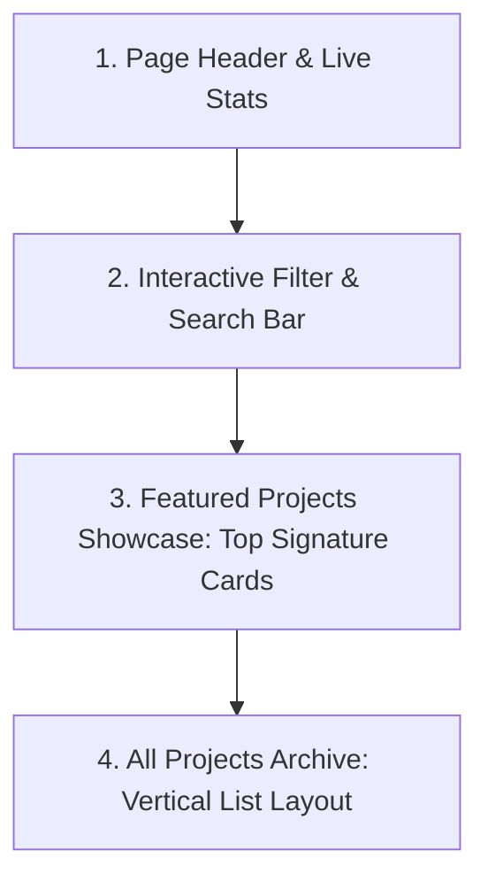

# Work Page Information Architecture & Content Strategy Specification

<callout icon="♞">**Status:** Active Specification · **Owner:** Sam Ananias Cases · **Date:** 2026-07-25 · **Version:** 1.1.0</callout>

This document is the official **Source of Truth** and Architecture Specification for the **Work Page (`/projects`)** and **Case Study Detail Template (`/projects/[slug]`)**. All future code modifications, card designs, layout changes, content additions, and AI implementations for the Work page must strictly adhere to the rules, hierarchy, chess piece symbolism, and scalability guidelines defined here.

---

## 1. Page Purpose & Positioning

### Primary Purpose

The Work page is the definitive showcase of engineering projects, architectural case studies, and code contributions. Rather than acting as an unorganized gallery of code repositories, it presents a **curated, storytelling-driven narrative of growth, systems thinking, and technical execution**.

### First 5–10 Seconds Takeaway

Within 10 seconds of landing on `/projects`, a visitor must understand:

1. **Top Tier Focus**: Signature projects that define the author's engineering identity.
2. **Real Technical Execution**: Clear, authentic project screenshots, role definitions, and full-stack capabilities.
3. **Depth & Breadth**: A scannable, structured archive catalog of all secondary projects, experiments, and early work.

### Intended Impression

- **Intentional & Content-First**: Free of decorative filler or generic placeholder cards.
- **Engraved Identity**: Grounded in the woodcut visual theme (`border-[2.5px] border-ink`, hard offset shadows `4px 4px 0 var(--color-ink)`, display typography).
- **Subtle Chess Metaphor**: Each featured project is represented by a dedicated chess piece symbol (♔ King, ♛ Queen, ♞ Knight) symbolizing its strategic role in the portfolio.

---

## 2. Visual Reference Analysis & Design Adaptations

Based on our analysis of `work-page-visual.html`, the following elements are adopted and integrated into our design system:

### Adopted & Streamlined Card Design

1. **Clean Image Banner with Grayscale Hover Transition**: Aspect-video preview banner using `grayscale contrast-105 group-hover:grayscale-0 transition-all duration-300`, keeping the editorial paper-and-ink aesthetic clean by default while revealing vibrant color on hover.
2. **Subtle Font Character Watermark**: A large font chess character (`♔`, `♛`, `♞`) positioned at the bottom-right corner (`font-serif text-[145px] rotate-[-7deg]` opacity `text-primary/10 dark:text-primary/15`). It adds instant identity matching `work-page-visual.html` without obscuring text.
3. **Structured Card Header & Footer**: Emblem badge (`♔ Signature System`, `♛ Technical Powerhouse`) on the top-left paired with a status pill (`COMPLETED`, `ACTIVE`) on the top-right. Concise 1-sentence description in the middle paired with a high-contrast action link (`Read case study →`) on the bottom.
4. **No Unnecessary Rankings**: 1st, 2nd, 3rd ranking prefixes are omitted to avoid arbitrary tiering, focusing on clear role descriptions.
5. **Streamlined Card Surface**: Key Decision blockquotes and Tech Stack tag pills are omitted from card faces to keep the surface minimal, focused, and scannable. (Technical decision breakdowns and stack details are presented inside the detail page).

### Layout Hierarchy

1. **Featured Showcase (2-Column Grid)**: Signature projects render in a balanced 2-column grid (`md:grid-cols-2`).
2. **All Projects Archive (Vertical List)**: Secondary and legacy projects transition into a clean, compact **Vertical List Layout** below the featured grid.

---

## 3. Chess Piece Symbolism & Mapping

Every project is assigned a strategic chess piece role:

| Chess Piece | Symbol | Strategic Role            | Selection Criteria                                                                                 | Authentic Project                                 |
| ----------- | ------ | ------------------------- | -------------------------------------------------------------------------------------------------- | ------------------------------------------------- |
| **King**    | ♔      | **Signature System**      | The project that best represents the author's core philosophy, systems architecture, and identity. | _Biometrics Integrated Timekeeping System (BITS)_ |
| **Queen**   | ♛      | **Technical Powerhouse**  | The most technically intensive, high-performance, or modern architecture project.                  | _Portfolio Architecture & Content System_         |
| **Knight**  | ♞      | **Creative Optimization** | The foundational, experimental, or legacy UI project.                                              | _Legacy Personal Web Portfolio_ (Archived)        |

---

## 4. Layout Architecture & Section Breakdown

The Work page (`/projects`) consists of **4 main sections**:



### Section 1: Page Header & Live Stats

- **Eyebrow**: `01 · PROOF OF WORK`
- **Title**: `Case Studies & Projects`
- **Description**: Plain-language introduction explaining the project collection and architectural focus.
- **Quick Stats Bar**: Count of total projects, active systems, and featured case studies.

### Section 2: Interactive Filter & Search Bar

- **Category Tabs**: `All Work`, `Architecture`, `Web Apps`.
- **Search Input**: Real-time client-side search filtering by project title, tag, or technology.

### Section 3: Featured Projects Showcase

- **Grid Structure**: Responsive 2-column grid (`md:grid-cols-2`).
- **Anatomy of a Featured Card**:
  1. **Header Badge**: Emblem Pill (`♔ Signature System` / `♛ Technical Powerhouse`) + Status Pill (`COMPLETED` / `ACTIVE`).
  2. **Image Banner**: Grayscale-to-color hover image preview (`heroImage`).
  3. **Title**: Bold Display Font, linked to `/projects/[slug]`.
  4. **Summary**: Concise 1-sentence project description.
  5. **CTA Link**: `Read case study →`.

### Section 4: All Projects Archive

- **Layout**: Clean vertical list items for archived projects (`legacy-portfolio.md`), displaying date, category, status pill, title, and `Read case study →` link.

---

## 5. Case Study Detail Page Specification (`/projects/[slug]`)

The Case Study Detail template provides deep technical storytelling for visitors who click into a project:

### Header & Executive Summary

1. **Back Navigation**: `← Back to projects` link in sentence case.
2. **Title & Status Header**: Full project title, status pill, role, and dates.
3. **Executive Summary Callout Box**: Prominent callout highlighting core context, key architectural choices, and verified outcomes.
4. **Hero Screenshot Display Banner**: Full-width screenshot container displaying high-resolution application interfaces.

### Two-Column Prose Narrative & Sticky Sidebar

- **Left Column (Prose Narrative)**:
  - `01. Problem & Context`
  - `02. Architecture & Key Trade-offs`
  - `03. System Implementation`
  - `04. Verification & Evidence`
  - `05. Retrospective & Lessons Learned`
- **Right Column (Sticky Engraved Sidebar)**:
  - Role & Duration details.
  - Technology Stack tags mapped from `skills` collection.
  - GitHub Repository & Live Demo links.
  - **Strategic Chess Piece Badge & Definition Card** explaining why the piece was assigned.

---

## 6. Content Schema & Validation Rules

Declared in `src/content.config.ts`:

```typescript
const projects = defineCollection({
  loader: glob({ pattern: "**/*.{md,mdx}", base: "./src/content/projects" }),
  schema: z.object({
    title: z.string(),
    summary: z.string(),
    role: z.string(),
    dates: z.string(),
    status: z.enum(["planning", "active", "completed", "archived"]),
    featured: z.boolean().default(false),
    stackRefs: z.array(z.string()).default([]),
    tags: z.array(z.string()).default([]),
    heroImage: z.string().optional(),
    chessPiece: z.enum(["king", "queen", "knight"]).optional(),
    chessRoleReason: z.string().optional(),
    keyTakeaway: z.string().optional(),
    category: z.enum(["architecture", "systems", "web", "tools"]).default("web"),
    links: z.array(z.object({ label: z.string(), url: z.string().url() })).default([]),
    outcomes: z.array(z.string()).default([]),
    seo: z.object({ title: z.string(), description: z.string() }).optional(),
  }),
});
```

---

## 7. Scalability & Lifecycle Strategy

1. **Adding New Projects**: As new projects are completed, set `featured: true` on signature projects and `featured: false` on secondary projects. Secondary projects automatically render in the Archive list without stretching the page.
2. **Portable Markdown Content**: All markdown content uses relative links and portable assets inside `public/images/projects/`.
3. **Automated Verification**: Every document and page edit is validated through Prettier, ESLint, Astro typecheck, and Playwright E2E / Accessibility suites.
