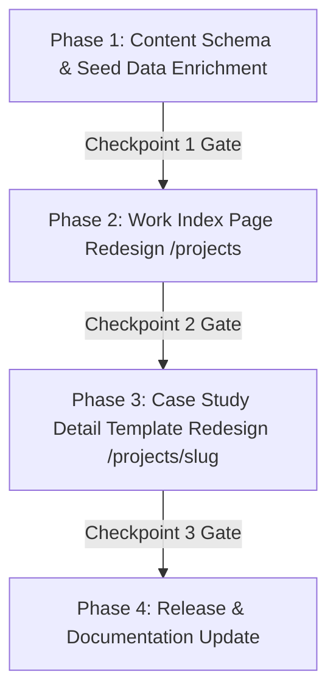

# Work Page Implementation Roadmap & Checkpoints

<callout icon="♞">**Status:** Completed Roadmap · **Owner:** Sam Ananias Cases · **Date:** 2026-07-25 · **Version:** 1.1.0</callout>

This document is the official **Execution Roadmap & Verification Plan** for building the Work Page (`/projects`) and Case Study Detail Page (`/projects/[slug]`) according to the [Work Page IA Specification](0002-work-page-specification.md).

---

## Phased Execution Roadmap

---

## Phase Matrix & Checkpoints

### Phase 1: Content Schema & Seed Data Enrichment `[COMPLETED ✅]`

Extend the Content Layer schema and enrich project markdown files with authentic repository details and strategic chess role explanations.

- [x] **Task 1.1**: Extend `projects` schema in `src/content.config.ts` with `chessPiece` (`"king" | "queen" | "knight"`), `chessRoleReason` (string), `keyTakeaway` (string), `heroImage` (string), and `category` (`"architecture" | "systems" | "web" | "tools"`).
- [x] **Task 1.2**: Update `src/content/projects/bits-timekeeping.md` with `chessPiece: "king"`, `category: "web"`, authentic BITS GitHub repo details (`https://github.com/avegabros/bits`), and screenshots.
- [x] **Task 1.3**: Update `src/content/projects/portfolio-architecture.md` with `chessPiece: "queen"`, `category: "architecture"`, authentic repository URL, and hero screenshot.
- [x] **Task 1.4**: Update `src/content/projects/legacy-portfolio.md` with `featured: false` for Archive placement.
- 🏁 **Checkpoint 1 Gate**: Execute `cmd /c "npx pnpm run check"` to verify Astro schema compilation (Passed ✅).

---

### Phase 2: Work Index Page Redesign (`/projects`) `[COMPLETED ✅]`

Rebuild the `/projects` page to feature Top Signature Showcase Cards, Grayscale-to-Color micro-interactions, clean font chess character watermarks (`work-page-visual.html`), streamlined 1-sentence summaries, and Secondary Vertical List Archive.

- [x] **Task 2.1**: Build Page Header & Quick Stats Bar (`Total Projects`, `Active Systems`, `Featured Case Studies`).
- [x] **Task 2.2**: Build Interactive Category Filter Tabs (`All Work`, `Architecture`, `Web Apps`) and Search Input box.
- [x] **Task 2.3**: Build Top Featured Showcase Grid:
  - Header emblem badge (`♔ Signature System`, `♛ Technical Powerhouse`) + status pill.
  - Project screenshot container with `grayscale(100%)` to full-color hover transition.
  - Bold Display Title + concise 1-sentence summary description.
  - Clean font chess character background watermark (`♔`, `♛`, `♞`) matching `work-page-visual.html`.
  - Sentence case action CTA (`Read case study →`).
- [x] **Task 2.4**: Build Secondary Projects Archive vertical list layout (`Date` | `Category` | `Title & Summary` | `Read case study →`).
- [x] **Task 2.5**: Embed vanilla JavaScript client-side script for instant category filtering and title/tag search.
- 🏁 **Checkpoint 2 Gate**: Verify card proportions, responsive breakpoints, and scannable summaries (Passed ✅).

---

### Phase 3: Case Study Detail Template Redesign (`/projects/[slug]`) `[COMPLETED ✅]`

Rebuild the `/projects/[slug]` template with structured narrative sections, an executive summary box, hero screenshot header, and sticky engraved sidebar featuring the Strategic Chess Piece Card.

- [x] **Task 3.1**: Build Detail Page Header: `← Back to projects` link, Eyebrow badge, Status pill, and Strategic Chess Emblem (`♔ Signature System`).
- [x] **Task 3.2**: Build Executive Summary Callout Box & Hero Screenshot Display Banner (`/images/projects/...`).
- [x] **Task 3.3**: Build 2-column prose layout + sticky engraved sidebar:
  - Left narrative: Markdown prose with embedded screenshots, architecture details, and core feature breakdowns.
  - Right sidebar: Role, Duration, Tech tags, External links, and **Strategic Chess Piece Badge & Definition Card**.
- [x] **Task 3.4**: Build Outcomes Evidence Box & Next/Previous Case Study footer pagination.
- 🏁 **Checkpoint 3 Gate**: Execute full verification suite (`format`, `lint`, `check`, `build`, `test:e2e`, `test:a11y`).

---

### Phase 4: Release & Documentation Update `[COMPLETED ✅]`

Log all changes and update project documentation.

- [x] **Task 4.1**: Update `docs/plans/README.md` index table with `0002.1-work-page-implementation-roadmap.md`.
- [x] **Task 4.2**: Record entry under `[Unreleased]` in `docs/Changelog.md`.
- [x] **Task 4.3**: Create `walkthrough.md` artifact summarizing completed Work page redesign.
