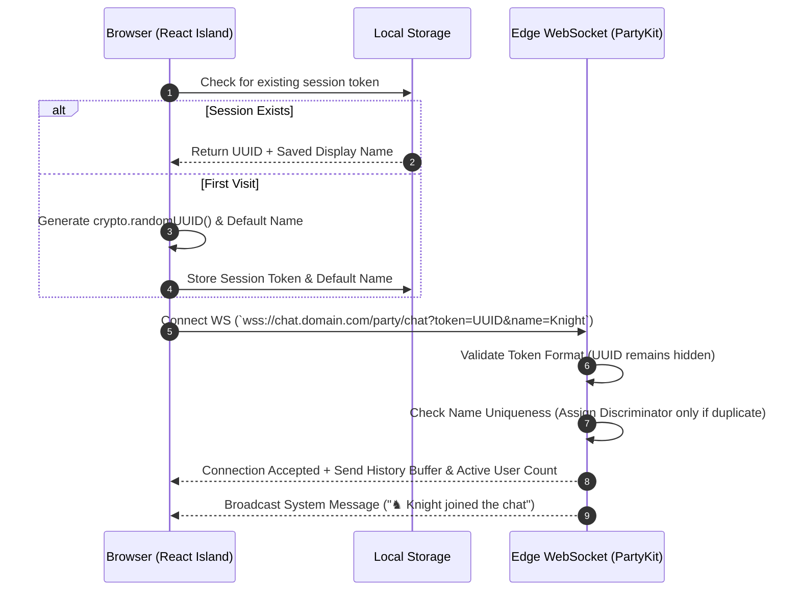
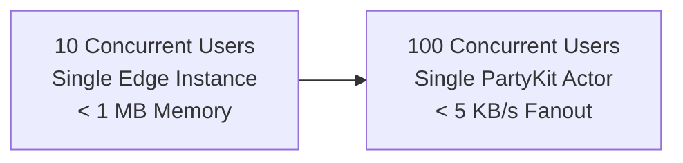
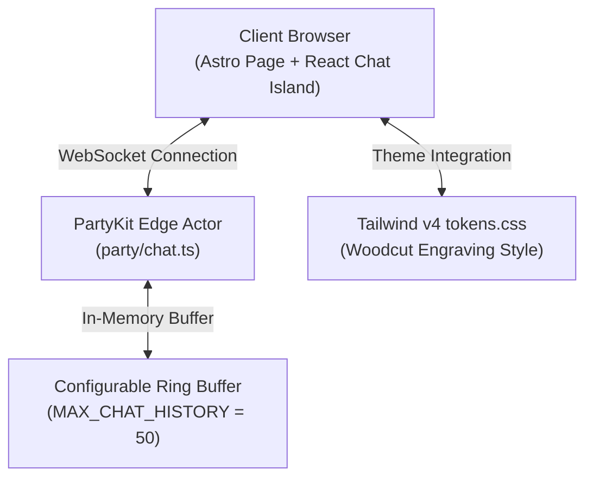
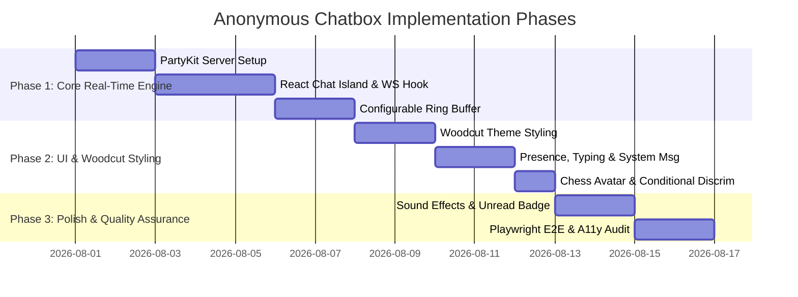

# Anonymous Real-Time Chatbox Architecture & Design Specification

<callout icon="♞">**Status:** Draft · **Owner:** Gen · **Date:** 2026-07-27</callout>

---

## 1. Executive Summary & Goal

This document provides a comprehensive technical architecture and design specification for adding a lightweight, **anonymous real-time chatbox** feature to the personal portfolio website.

### Product & UX Goals

- **Instant Participation**: Any visitor can join the chat instantly by choosing a temporary display name—no account creation, passwords, or logins required.
- **Low Latency & Live Presence**: Fast, real-time message broadcasting across active visitors, live active user count, real-time typing indicators, and optional server system events (`♞ Alex joined the chat`).
- **Aesthetic Integration**: Seamlessly matches the project's **Woodcut & Engraving visual language** (high-contrast monochrome, hard offset shadows, line-art framing, custom chess-themed avatar badges).
- **Lightweight & Ephemeral**: 100% in-memory architecture with a configurable ring buffer (`MAX_CHAT_HISTORY = 50`), zero database dependencies, zero maintenance overhead, and fast edge performance.

---

## 2. Architectural Evaluation: Communication Protocols

Real-time web applications generally leverage one of four primary communication models. Below is a comparative evaluation of each protocol for our anonymous portfolio chat use case.

### Protocol Comparison Matrix

| Criteria                              | WebSockets (WS)                                                                    | Server-Sent Events (SSE) + HTTP POST                                           | HTTP Long Polling                                      | Managed WebSockets (e.g. Ably/Pusher)            |
| :------------------------------------ | :--------------------------------------------------------------------------------- | :----------------------------------------------------------------------------- | :----------------------------------------------------- | :----------------------------------------------- |
| **Directionality**                    | Full Duplex (Bidirectional over 1 TCP connection)                                  | Half Duplex (Server-to-Client SSE stream + Client-to-Server POST)              | Half Duplex (Repeated HTTP requests)                   | Full Duplex                                      |
| **Latency**                           | Extremely Low (< 20ms)                                                             | Low (< 50ms for push; POST roundtrip for send)                                 | Moderate (100ms - 500ms latency overhead)              | Extremely Low (< 20ms)                           |
| **Protocol Overhead**                 | Minimal (2-6 byte frame headers after initial HTTP handshake)                      | Low HTTP header overhead for SSE stream; Full HTTP headers per POST            | High (Full HTTP header overhead on every poll request) | Minimal                                          |
| **Connection Limits & Server Impact** | High concurrency supported via edge actors (PartyKit / Cloudflare Durable Objects) | Requires open HTTP connection per client; potential connection pool exhaustion | Heavy HTTP request churn on serverless functions       | Handled externally by third-party infrastructure |
| **State & Reconnection**              | Automatic reconnect handlers; simple binary/json frame messaging                   | Built-in browser reconnect (`EventSource`); client handles POST retries        | Client manual loop & timeout handling                  | SDK handles client state & reconnection          |
| **Cost & Dependencies**               | Native Cloudflare edge execution (included in host)                                | Native edge functions                                                          | Native edge functions                                  | Monthly tier fees / Third-party dependency       |

### Recommended Communication Protocol: WebSockets via Serverless Edge Actors (PartyKit / Cloudflare Durable Objects)

#### Justification:

1. **Full-Duplex Efficiency**: WebSockets keep a single persistent TCP connection open between the browser and edge server. Messages flow bi-directionally with sub-millisecond protocol overhead.
2. **Presence & Disconnect Reliability**: WebSockets allow instant detection of connection dropouts via server-side close events and heartbeats (ping/pong frames).
3. **Alignment with Deployment Stack**: Since our portfolio is deployed on Cloudflare Pages, PartyKit (which runs directly on Cloudflare Workers & Durable Objects) provides native WebSocket routing at global edge locations without complex backend setup.

---

## 3. Data Storage & State Management Architecture

To keep the application simple, maintainable, and cost-free, we evaluate storage approaches based on operational overhead and performance.

### Data Storage Comparison Matrix

| Storage Strategy                               | Pros                                                                                                                                                                                                         | Cons                                                                                                                                                         | Verdict for Personal Portfolio                                                |
| :--------------------------------------------- | :----------------------------------------------------------------------------------------------------------------------------------------------------------------------------------------------------------- | :----------------------------------------------------------------------------------------------------------------------------------------------------------- | :---------------------------------------------------------------------------- |
| **1. Pure In-Memory Configurable Ring Buffer** | • Fastest possible read/write performance (< 1ms)<br>• Zero database queries, schemas, or I/O costs<br>• Configurable capacity (`MAX_CHAT_HISTORY = 50`) <br>• Zero maintenance footprint & privacy-friendly | • Messages clear on global server restart or code redeploy                                                                                                   | **Recommended Choice**. Perfect fit for a lightweight portfolio side feature. |
| **2. Persistent Database (D1 / SQL / KV)**     | • 100% durable chat history across restarts                                                                                                                                                                  | • Requires database schemas, migrations, and API credentials<br>• Increases latency and storage costs<br>• Adds moderation liability for old stored messages | **Not Recommended**. Over-engineered for a simple portfolio chat.             |
| **3. Complex Hybrid Storage**                  | • Persistence + fast memory cache                                                                                                                                                                            | • Dual-layer complexity and state sync issues                                                                                                                | **Not Recommended**. Unnecessary overhead for portfolio scope.                |

### Recommended Storage Design: Configurable In-Memory Ring Buffer

- **Configurable Ring Buffer (`MAX_CHAT_HISTORY = 50`)**: The edge WebSocket server maintains a simple array in memory capped at `MAX_CHAT_HISTORY` (defaulting to 50 messages). When the buffer reaches capacity, the oldest message is automatically dropped when a new message arrives (`array.shift()`). The buffer size can be adjusted via server config without changing the underlying architecture.
- **Instant Client Synchronization**: When a new user opens the chat widget, the server immediately sends the current in-memory message history buffer over the WebSocket connection.
- **Zero Database Requirement**: No external databases, KV stores, or persistent disk storage are required.

---

## 4. User Identity, Discriminators & System Messages

Since the chat is completely anonymous and account-free, user identification relies on client-generated session tokens to manage connections and handle display names cleanly.



### Identity & Messaging Specifications

1. **Internal Session Token (UUID v4)**:
   - Generated client-side on first chat open via `crypto.randomUUID()`.
   - Saved in browser `localStorage` (`portfolio_chat_session`).
   - Sent during the initial WebSocket handshake for internal connection management and rate limiting.
   - **Strictly Hidden**: The UUID is strictly internal and **never displayed to users** in the UI.

2. **Clean Display Names & Conditional Discriminators**:
   - Users can enter any custom display name (1–20 characters, sanitized). If omitted, a chess-themed title is assigned (e.g. `TacticalKnight`, `EngravedRook`).
   - **Unique Name Display**: If a user's display name is unique among connected clients, it is shown cleanly as just the name (e.g., `Sam`).
   - **Conditional Discriminator**: Only when multiple connected users share the exact same display name does the server append a 4-digit discriminator derived from their session UUID (e.g., `Sam` and `Sam#4912`) to prevent UI ambiguity.
   - **Reserved Names**: Display names containing "Admin", "System", "Mod", or owner names automatically receive a `[Guest]` tag to prevent identity spoofing.

3. **Lightweight System Messages**:
   - The server can emit lightweight, system-generated event messages to make the chat feel alive:
     - **Welcome**: `Welcome to the portfolio chat!` (sent privately on connection)
     - **Join Event**: `♞ Alex joined the chat` (broadcast when a new session connects)
     - **Leave Event**: `♜ Sam left the chat` (broadcast when a socket disconnects)
   - **Properties**: System messages do not count toward client rate limits, are visually styled with distinct muted/italicized engraving typography, and can be toggled on/off via server config (`ENABLE_SYSTEM_MESSAGES = true`).

4. **Presence & Mount-Only Connection Lifecycle**:
   - Lifecycle events update the active socket registry in memory.
   - Live user count (e.g., `● 7 Online`) is broadcast to all clients on connection changes.
   - **Mount-Only Connection Effect**: The client hook (`useChatSocket`) initializes the WebSocket connection once on component mount using a stable `displayNameRef`. Updating display names or typing signals sends frames over the existing socket without closing or reconnecting.
   - **Non-Blocking Input & Optimistic Fallback**: The message input field in `ChatBox.tsx` remains enabled at all times to prevent typing interruptions or focus loss. If offline or connecting, messages are optimistically added locally.
   - Heartbeat ping/pong frames run every 30 seconds to clean up inactive sockets.

---

## 5. Scalability & Load Analysis

This design is specifically optimized for realistic portfolio site traffic (typically ranging from **10 to 100 concurrent chat visitors**).



### Portfolio Traffic Breakdown

#### Tier 1: 10 Concurrent Users

- **Performance**: PartyKit edge actor handles 10 concurrent connections seamlessly.
- **Resource Usage**: < 1 MB memory, ~0.1% CPU utilization.
- **Latency**: Sub-20ms global latency via Cloudflare edge routing.

#### Tier 2: 100 Concurrent Users

- **Performance**: Easily remains within a single edge actor's capacity (PartyKit / Cloudflare Durable Objects support thousands of concurrent connections per room).
- **Bandwidth**: Broadcast fan-out for 100 users requires ~20 KB/s outbound bandwidth at peak message rates.
- **Latency**: Sub-30ms response times.

> **Design Choice**: Complex multi-region sharded pub/sub backplanes or distributed message broadcasters are intentionally omitted, keeping the codebase simple and lightweight.

---

## 6. Security, Moderation & Anti-Abuse System

To maintain a friendly environment without user registration, the chatbox employs a streamlined 4-layer defense system.

```
+-------------------------------------------------------------------+
| LAYER 1: Client Payload Validation (Max 280 chars, HTML Escaping)  |
+-------------------------------------------------------------------+
                                  |
+-------------------------------------------------------------------+
| LAYER 2: Token Bucket Rate Limiter (Max 3 msg / 5s per Session)   |
+-------------------------------------------------------------------+
                                  |
+-------------------------------------------------------------------+
| LAYER 3: Automated Profanity & Link Stripping Filter              |
+-------------------------------------------------------------------+
                                  |
+-------------------------------------------------------------------+
| LAYER 4: Duplicate Message & Rapid Spam Suppression               |
+-------------------------------------------------------------------+
```

### Defense Matrix Specifications

1. **Payload Boundaries & HTML Sanitization**:
   - **Message Length**: Strictly limited to **280 characters**.
   - **XSS Prevention**: All incoming text payloads are HTML-escaped on the server before broadcasting. HTML tags, `<script>` tags, and inline formatting code are rendered as plain text.

2. **Rate Limiting (Token Bucket Algorithm)**:
   - **Per-Session Limit**: Maximum 3 messages within any 5-second window.
   - **Burst Allowance**: 5 messages maximum.
   - **Action on Violation**: Excess messages are rejected with a rate-limit warning frame sent only to the sender, accompanied by a brief client-side cooldown timer. (System messages are exempt from rate limiting).

3. **Spam & Duplicate Message Suppression**:
   - **Duplicate Message Check**: Submitting the exact same message string twice within 30 seconds is silently ignored.
   - **Link Protection**: Raw URLs are converted to unclickable plain text to prevent phishing or spam links.

4. **Profanity Filter**:
   - **Pattern Matching**: Common inappropriate words and slurs are sanitized on the server with `***` masks prior to broadcasting.

5. **Connection Clean-up**:
   - **Ping/Pong Heartbeat**: The server issues a ping every 30 seconds. Disconnected sockets are closed to prevent memory leaks.

---

## 7. Persistence & Ephemerality Policy

| Aspect                      | Policy Specification                       | Rationale                                                                                     |
| :-------------------------- | :----------------------------------------- | :-------------------------------------------------------------------------------------------- |
| **Storage Model**           | **100% In-Memory Only**                    | Zero database configuration, zero maintenance costs, maximum performance.                     |
| **Capacity Cap**            | **`MAX_CHAT_HISTORY = 50`** (Configurable) | Keeps initial payload tiny (~10 KB) while giving new visitors immediate conversation context. |
| **Server Restart Behavior** | **Intentional Reset**                      | Chat history resets cleanly when the server restarts or redeploys.                            |
| **Data Retention**          | **No History Kept**                        | Ephemeral by design—enhances visitor privacy and eliminates long-term data management.        |

---

## 8. Recommended Technology Stack

The chat feature seamlessly integrates with the portfolio's tech stack (**Astro v7 static SSG + React + Tailwind CSS v4**):



### Technology Breakdown

1. **Edge Real-Time Layer: PartyKit (built on Cloudflare Durable Objects)**
   - **Why it fits**: PartyKit simplifies real-time WebSocket applications on Cloudflare edge compute. It provides built-in room state management, easy local dev tools (`npx partykit dev`), and zero backend maintenance.

2. **Client Interface: React Island (`client:idle`)**
   - **Why it fits**: Astro uses React islands for interactive features. The widget (`src/components/chat/ChatBox.tsx`) hydrates asynchronously via `client:idle`, ensuring zero impact on initial page load times or Lighthouse performance scores.

3. **Styling: Tailwind CSS v4 + Project Tokens**
   - **Why it fits**: Mapped to semantic tokens (`tokens.css`) matching the site's woodcut aesthetic (monochrome linework, crisp borders, hard offset shadows like `3px 3px 0 var(--color-border-custom)`).

4. **Icons & Badges: Chess Motif System (`/public/icons/chess/`)**
   - **Why it fits**: Uses chess piece icons (Knight, Rook, Bishop, Pawn) for user avatars, system message icons, and status indicators.

5. **Navigation Placement & Entry Point (`BaseLayout.astro`)**
   - **Navbar / Sidebar Button**: A prominent navigation button (`Chat ♞` or `Live Chat`) integrated into the Desktop Sidebar (under the `META` group or top navigation section) and Mobile Overlay Menu.
   - **Live Presence Indicator**: Displays an inline live status badge (e.g. `● 3`) next to the navigation bar button.
   - **Fullscreen Modal with Blurred Backdrop**: Clicking the navigation button smoothly opens a **fullscreen modal overlay** (`fixed inset-0 z-[100]`) with a frosted glass **background blur** (`backdrop-blur-md bg-bg/85 dark:bg-bg/90`).
   - **Woodcut Modal Frame**: Centered responsive chat interface framed with structural woodcut linework (`border-structural`), crisp headers, clean `Close (X)` button, and keyboard escape traps.
   - **Optional Floating Widget**: Can also toggle via a persistent bottom-right floating trigger button (`fixed bottom-6 right-6`).

---

## 9. Implementation Roadmap & Phased Execution Plan



### Phase 1: Core Real-Time Engine (MVP)

- Create PartyKit server handler (`party/chat.ts`).
- Create `src/components/chat/ChatBox.tsx` React component.
- Implement WebSocket client connection hook (`useChatSocket.ts`) with automatic reconnection.
- Implement in-memory configurable ring buffer (`MAX_CHAT_HISTORY = 50`).
- Add client & server payload sanitization (HTML escaping) and token-bucket rate limiting (3 msgs / 5s).

### Phase 2: UI & Woodcut Theme Integration

- Style the chat widget using the **Woodcut Engraving Design System** (crisp linework, hard offset shadows, Fraunces/Inter typography).
- Add live online user counter (`● N online`), typing indicator (`Rook#1234 is typing...`), and server system messages (`♞ Alex joined the chat`).
- Implement clean display names with conditional discriminators (only showing `#1234` when name collisions occur).
- Assign random chess piece avatar icons (Knight, Rook, Bishop, Pawn) to guest sessions.
- Add floating chat trigger button with unread message counter badge.

### Phase 3: Polish & Quality Assurance

- Add optional audio toggle (subtle wood block click sound on sent/received messages).
- Enhance keyboard accessibility (focus trap in open modal, `aria-live="polite"` region for new messages, `Escape` key close handler).
- Write Playwright E2E test suite in `tests/chat.spec.ts` for multi-browser real-time messaging and system events.
- Run axe-core accessibility audit (`npx pnpm run test:a11y`).

---

## 10. Verification & Quality Assurance Strategy

To ensure code quality and prevent regressions:

1. **Automated Code Standards**:
   - `cmd /c "npx pnpm run format"` (Prettier formatting)
   - `cmd /c "npx pnpm run lint"` (ESLint checks)
   - `cmd /c "npx pnpm run check"` (Astro & TypeScript typechecking)
   - `cmd /c "npx pnpm run build"` (Production SSG build verification)

2. **Playwright E2E Tests (`tests/chat.spec.ts`)**:
   - Verify multi-browser sessions connecting, sending messages, receiving system messages, and broadcasting in real time.
   - Verify conditional discriminator behavior (clean name for unique users; `#1234` suffix when duplicate name joins).
   - Verify rate limiting triggers when rapid messages are sent.
   - Verify HTML escaping prevents script injection attacks.

3. **Accessibility Audit (`tests/a11y.spec.ts`)**:
   - Ensure screen readers correctly announce incoming user and system messages via `aria-live`.
   - Verify full keyboard navigability and focus ring visibility.
