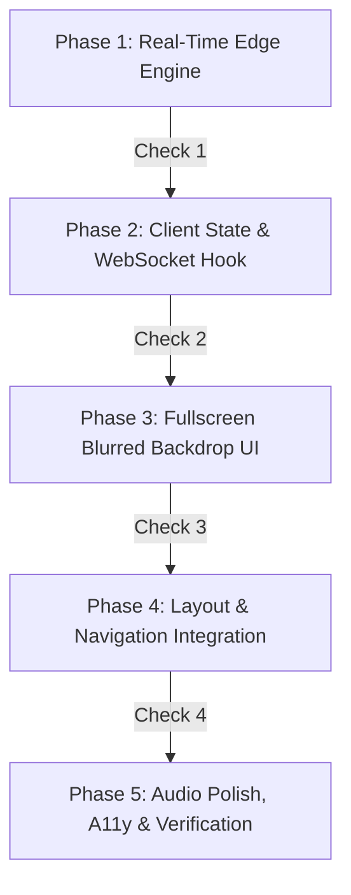

# Anonymous Real-Time Chatbox Implementation Roadmap & Checkpoints

<callout icon="♞">**Status:** Implemented · **Owner:** Gen · **Date:** 2026-07-27 · **Version:** 1.1.0</callout>

> **Transport Migration Note (2026-08-06):** Updated to reflect the production migration from PartyKit WebSockets to HTTP polling (3s interval) with Cloudflare KV (`CHAT_KV`).

This document is the official **Execution Roadmap & Verification Plan** for building the Anonymous Real-Time Chatbox according to the [Anonymous Real-Time Chatbox Architecture & Design Specification](0003-anonymous-realtime-chatbox-specification.md).

---

## Phased Execution Roadmap

---

## Phase Matrix & Checkpoints

### Phase 1: Real-Time Edge Engine Setup `[COMPLETED ✅]`

Establish the PartyKit WebSocket server and in-memory message buffer.

- [x] **Task 1.1**: Configure PartyKit project configuration (`partykit.json`).
- [x] **Task 1.2**: Create PartyKit WebSocket server handler in `party/chat.ts`.
- [x] **Task 1.3**: Implement in-memory configurable ring buffer (`MAX_CHAT_HISTORY = 50`) using array drop (`array.shift()`) on buffer overflow.
- [x] **Task 1.4**: Implement server-side payload HTML escaping & sanitization to prevent XSS.
- [x] **Task 1.5**: Implement Token Bucket rate limiting per session UUID (max 3 messages per 5 seconds).
- [x] **Task 1.6**: Implement Server System Event emitter (`ENABLE_SYSTEM_MESSAGES = true`) broadcasting join (`♞ Alex joined`) and leave (`♜ Sam left`) notifications.
- 🏁 **Checkpoint 1 Gate**: `cmd /c "npx pnpm run format"`, `cmd /c "npx pnpm run lint"`, `cmd /c "npx pnpm run check"`.

---

### Phase 2: Client State, WebSocket Hook & Display Name Management `[COMPLETED ✅]`

Build the React client state manager and session token logic.

- [x] **Task 2.1**: Create React hook `src/components/chat/useChatSocket.ts` to manage WebSocket lifecycle, auto-reconnection with exponential backoff, and message state.
- [x] **Task 2.2**: Implement client-side `localStorage` session token generation (`crypto.randomUUID()`) kept strictly internal and hidden from the UI.
- [x] **Task 2.3**: Implement display name management and server-side conditional discriminator logic (only showing `#1234` when a name collision occurs).
- [x] **Task 2.4**: Implement online user presence tracking (`● N Online`) and real-time typing indicator timeout.
- 🏁 **Checkpoint 2 Gate**: `cmd /c "npx pnpm run format"`, `cmd /c "npx pnpm run lint"`, `cmd /c "npx pnpm run check"`.

---

### Phase 3: Fullscreen Blurred Backdrop UI & Woodcut Component Setup `[COMPLETED ✅]`

Build the React Chat modal component styled with the Woodcut Engraving aesthetic.

- [x] **Task 3.1**: Create `src/components/chat/ChatBox.tsx` React component.
- [x] **Task 3.2**: Style the fullscreen modal overlay (`fixed inset-0 z-[100]`) with frosted glass background blur (`backdrop-blur-md bg-bg/85 dark:bg-bg/90`).
- [x] **Task 3.3**: Frame the chat container using Woodcut Engraving design system tokens (`border-structural`, hard offset shadows `3px 3px 0 var(--color-border-custom)`).
- [x] **Task 3.4**: Render message list with distinct styles for user messages, chess avatar badges (Knight, Rook, Bishop, Pawn), and muted italicized system messages.
- [x] **Task 3.5**: Implement message input field, send button, 280-character counter, and automatic scroll-to-bottom behavior.
- 🏁 **Checkpoint 3 Gate**: `cmd /c "npx pnpm run format"`, `cmd /c "npx pnpm run lint"`, `cmd /c "npx pnpm run check"`, `cmd /c "npx pnpm run build"`.

---

### Phase 4: Layout & Navigation Integration (`BaseLayout.astro`) `[COMPLETED ✅]`

Integrate the chat trigger button into the site header and navigation bar.

- [x] **Task 4.1**: Add `Live Chat ♞` navigation button to Desktop Sidebar in `src/layouts/BaseLayout.astro` under the `META` navigation group.
- [x] **Task 4.2**: Add `Live Chat ♞` navigation link to Mobile Overlay Menu in `src/layouts/BaseLayout.astro`.
- [x] **Task 4.3**: Render inline live presence badge (e.g. `● 3`) next to the navigation trigger button.
- [x] **Task 4.4**: Mount `ChatBox.tsx` React island asynchronously with `client:idle` at layout root via `ChatWidget.tsx`.
- [x] **Task 4.5**: Add persistent floating trigger button in bottom-right corner (`fixed bottom-6 right-6 z-40`) with unread badge.
- 🏁 **Checkpoint 4 Gate**: `cmd /c "npx pnpm run format"`, `cmd /c "npx pnpm run lint"`, `cmd /c "npx pnpm run check"`, `cmd /c "npx pnpm run build"`.

---

### Phase 5: Audio Polish, Accessibility & Full Verification Suite `[COMPLETED ✅]`

Finalize polish, accessibility compliance, and end-to-end testing.

- [x] **Task 5.1**: Add subtle wood block click audio feedback for incoming/outgoing messages using Web Audio API in `ChatWidget.tsx`.
- [x] **Task 5.2**: Add accessibility focus trap for the open fullscreen modal, `aria-live="polite"` live region for new messages, and `Escape` key close handler.
- [x] **Task 5.3**: Write Playwright E2E integration test suite in `tests/chat.spec.ts` testing multi-browser session connections, message exchange, rate limiting, and system events.
- [x] **Task 5.4**: Run axe-core accessibility audit (`npx pnpm run test:a11y`).
- 🏁 **Checkpoint 5 Gate (Definition of Done)**:
  1. `cmd /c "npx pnpm run format"`
  2. `cmd /c "npx pnpm run lint"`
  3. `cmd /c "npx pnpm run check"`
  4. `cmd /c "npx pnpm run build"`
  5. `cmd /c "npx pnpm run test:e2e"`
  6. `cmd /c "npx pnpm run test:a11y"`
